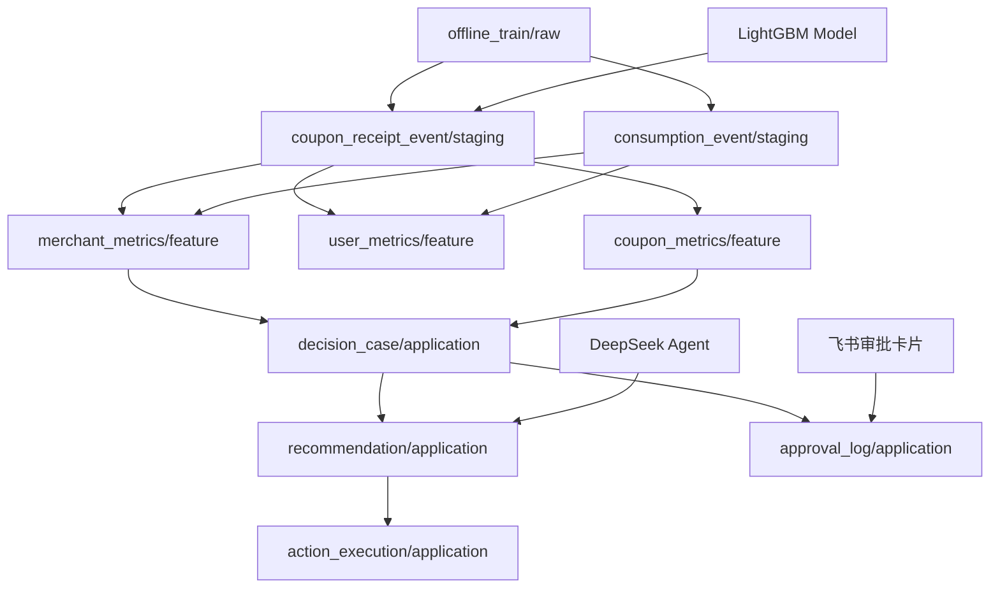

# Data Model: 优惠券运营决策 Agent 系统

**Feature**: 001-coupon-decision-agent | **Date**: 2026-05-17

## Overview

本文档定义系统核心实体、字段、关系和状态流转，支持 PostgreSQL 数据库设计和 Alembic 迁移脚本生成。

---

## 数据分层架构

### Raw Layer (原始数据层)

保持天池CSV数据原样，仅做类型转换。

| Table | Schema | Purpose | Source |
|-------|--------|---------|--------|
| offline_train | raw | 线下训练数据（含领券、消费记录） | offline_train.csv |
| offline_test | raw | 线下测试数据（预测样本） | offline_test.csv |

---

### Staging Layer (事件清洗层)

清洗原始数据为业务事件表，建立索引支持快速查询。

| Table | Schema | Purpose | Fields |
|-------|--------|---------|--------|
| coupon_receipt_event | staging | 领券事件（原子粒度） | user_id, merchant_id, coupon_id, discount_rate, distance, date_received, is_redeemed, date_redeemed |
| consumption_event | staging | 消费事件（含用券和普通消费） | user_id, merchant_id, coupon_id (nullable), discount_rate (nullable), date, amount (nullable - 模拟字段) |

**Indexes**:
- coupon_receipt_event: (user_id, date_received), (merchant_id, date_received), (coupon_id)
- consumption_event: (user_id, date), (merchant_id, date)

---

### Feature Layer (聚合特征层)

存储预计算的聚合指标，避免每次查询重新计算。

| Table | Schema | Purpose | Refresh Strategy |
|-------|--------|---------|------------------|
| merchant_metrics | feature | 商户维度聚合指标 | 每日物化视图刷新（Celery Beat） |
| user_metrics | feature | 用户维度聚合指标 | 每日物化视图刷新 |
| coupon_metrics | feature | 优惠券维度聚合指标 | 每日物化视图刷新 |

---

### Application Layer (业务实体层)

存储决策案例、建议和执行记录。

| Table | Schema | Purpose |
|-------|--------|---------|
| decision_case | application | 决策案例（规则触发产生） |
| recommendation | application | Agent 输出的决策建议 |
| action_execution | application | Mock Action 执行记录 |
| approval_log | application | 审批记录（含状态变更轨迹） |

---

## Core Entities

### 1. User (用户)

**Description**: 优惠券接收者，具有领券和消费行为。

**Storage**: 不单独建表，特征存储在 `user_metrics` 表。

**Key Attributes** (in user_metrics):
- `user_id` (STRING, PK): 用户唯一标识
- `total_receipts_30d` (INTEGER): 近30日领券总数
- `redeemed_count_30d` (INTEGER): 近30日核销数量
- `redeemed_rate_30d` (FLOAT): 近30日核销率
- `avg_distance` (FLOAT): 平均距离倾向
- `last_receipt_date` (DATE): 最后领券日期
- `updated_at` (TIMESTAMP): 指标刷新时间

**Relationships**:
- 一对多 `CouponReceiptEvent`（领券记录）
- 一对多 `ConsumptionEvent`（消费记录）

---

### 2. Merchant (商户)

**Description**: 发放优惠券的商户，关键监控对象。

**Storage**: 特征存储在 `merchant_metrics` 表。

**Key Attributes** (in merchant_metrics):
- `merchant_id` (STRING, PK): 商户唯一标识
- `total_receipts_7d` (INTEGER): 近7日发券总数
- `redeemed_count_7d` (INTEGER): 近7日核销数量
- `redeemed_rate_7d` (FLOAT): 近7日核销率
- `total_receipts_30d` (INTEGER): 近30日发券总数
- `redeemed_count_30d` (INTEGER): 近30日核销数量
- `redeemed_rate_30d` (FLOAT): 近30日核销率
- `redeemed_rate_change` (FLOAT): 核销率变化幅度（(rate_7d - rate_30d) / rate_30d）
- `avg_discount_depth` (FLOAT): 平均折扣深度
- `total_coupons_types` (INTEGER): 券类型数量
- `activity_health_score` (FLOAT): 活动健康分（综合指标）
- `last_activity_date` (DATE): 最后活动日期
- `updated_at` (TIMESTAMP): 指标刷新时间

**Relationships**:
- 一对多 `CouponReceiptEvent`（发券记录）
- 一对多 `ConsumptionEvent`（消费记录）
- 一对多 `CouponMetrics`（券类型）
- 一对多 `DecisionCase`（决策案例）

---

### 3. Coupon (优惠券)

**Description**: 优惠券实体，区分类型和折扣深度。

**Storage**: 特征存储在 `coupon_metrics` 表。

**Key Attributes** (in coupon_metrics):
- `coupon_id` (STRING, PK): 优惠券唯一标识
- `merchant_id` (STRING, FK): 所属商户
- `discount_type` (STRING): 券类型（"满减" or "折扣"）
- `discount_rate` (STRING): 原始折扣描述（如 "200:50" 或 "0.9"）
- `discount_value` (FLOAT): 折扣实际值（满减：减免金额/门槛金额，折扣：1-折扣率）
- `threshold_amount` (FLOAT): 门槛金额（满减券）
- `discount_amount` (FLOAT): 减免金额（满减券）
- `total_receipts` (INTEGER): 总发券量
- `redeemed_count` (INTEGER): 总核销量
- `redeemed_rate` (FLOAT): 总核销率
- `avg_redeem_days` (FLOAT): 平均核销天数（领券到核销间隔）
- `updated_at` (TIMESTAMP): 指标刷新时间

**Relationships**:
- 属于 `Merchant`（merchant_id）
- 一对多 `CouponReceiptEvent`

---

### 4. CouponReceiptEvent (领券事件)

**Description**: 用户领券的原子事件，建模核心粒度。

**Schema**: `staging.coupon_receipt_event`

**Key Attributes**:
- `id` (BIGINT, PK, AUTO_INCREMENT): 事件ID
- `user_id` (STRING, NOT NULL): 用户ID
- `merchant_id` (STRING, NOT NULL): 商户ID
- `coupon_id` (STRING, NOT NULL): 优惠券ID
- `discount_rate` (STRING): 折扣描述
- `distance` (FLOAT): 用户距离（单位：500米档位）
- `date_received` (DATE, NOT NULL): 领券日期
- `is_redeemed` (BOOLEAN): 是否核销
- `date_redeemed` (DATE): 核销日期（若核销）
- `redeem_days` (INTEGER): 核销天数（date_redeemed - date_received）
- `predicted_probability` (FLOAT): ML模型预测的核销概率（推理后填充）

**Indexes**:
- PRIMARY KEY: `id`
- INDEX: `idx_user_date` (user_id, date_received)
- INDEX: `idx_merchant_date` (merchant_id, date_received)
- INDEX: `idx_coupon` (coupon_id)

**Validation Rules**:
- `date_received` MUST NOT be NULL
- `is_redeemed = true` → `date_redeemed` MUST NOT be NULL
- `redeem_days` MUST be between 0 and 15 (if redeemed)

---

### 5. DecisionCase (决策案例)

**Description**: 由规则触发产生的决策案例，核心业务实体。

**Schema**: `application.decision_case`

**Key Attributes**:
- `id` (BIGINT, PK, AUTO_INCREMENT): 案例ID
- `case_type` (STRING, NOT NULL): 案例类型（"商户异常"、"券策略复核"、"用户召回"）
- `severity_level` (STRING): 严重级别（"高"、"中"、"低"）
- `merchant_id` (STRING, FK): 关联商户（商户异常案例）
- `coupon_id` (STRING, FK): 关联优惠券（券策略复核案例）
- `user_id` (STRING, FK): 关联用户（用户召回案例）
- `trigger_rule_id` (STRING): 触发规则ID（YAML规则名称）
- `trigger_metrics_snapshot` (JSONB): 触发时的指标快照
- `status` (STRING, NOT NULL): 状态（见状态流转）
- `created_at` (TIMESTAMP): 创建时间
- `updated_at` (TIMESTAMP): 更新时间

**State Transitions**:
- `pending` (待处理) → `recommended` (已建议)：Agent生成建议后
- `recommended` → `approved` (已审批)：审批通过
- `recommended` → `rejected` (已驳回)：审批拒绝
- `rejected` → `recommended` (重新生成建议)：允许回退，迭代优化
- `approved` → `executed` (已执行)：Mock Action执行完成
- `executed` → `completed` (已完成)：执行结果确认
- ANY → `failed` (失败)：Agent诊断失败或执行失败

**Indexes**:
- INDEX: `idx_merchant_status` (merchant_id, status)
- INDEX: `idx_status_created` (status, created_at)
- INDEX: `idx_type_date` (case_type, created_at)

**Validation Rules**:
- `case_type` MUST be one of ["商户异常", "券策略复核", "用户召回"]
- `status` MUST be one of ["pending", "recommended", "approved", "rejected", "executed", "completed", "failed"]
- State transitions MUST follow defined flow（允许 rejected → recommended 回退）

---

### 6. Recommendation (Agent 建议)

**Description**: Agent 生成的结构化决策建议。

**Schema**: `application.recommendation`

**Key Attributes**:
- `id` (BIGINT, PK, AUTO_INCREMENT): 建议ID
- `case_id` (BIGINT, FK): 关联决策案例
- `summary` (TEXT): 决策摘要（一句话结论）
- `evidence_list` (JSONB, NOT NULL): 证据列表（≥3条证据）
  ```json
  [
    {"type": "指标异常", "content": "商户核销率下降25%", "source": "get_merchant_metrics"},
    {"type": "券策略问题", "content": "高折扣券转化率仅5%", "source": "get_coupon_conversion"},
    {"type": "历史对比", "content": "上周同期核销率为65%", "source": "get_merchant_metrics"}
  ]
  ```
- `suggested_actions` (JSONB, NOT NULL): 建议动作列表
  ```json
  [
    {"action_type": "暂停活动", "params": {"merchant_id": "xxx", "duration": "7天"}, "risk_level": "高"},
    {"action_type": "调整折扣", "params": {"coupon_id": "yyy", "new_discount": "0.85"}, "risk_level": "中"}
  ]
  ```
- `risk_alerts` (TEXT): 风险提示
- `confidence_score` (FLOAT, NOT NULL): 置信度评分（0.0-1.0）
- `requires_approval` (BOOLEAN, NOT NULL): 是否需要人工审批（高风险建议 MUST be true）
- `tool_trace` (JSONB): Agent工具调用轨迹（审计用）
  ```json
  [
    {"tool": "get_merchant_metrics", "args": {"merchant_id": "xxx"}, "result": {...}, "timestamp": "..."},
    {"tool": "get_coupon_conversion", "args": {"coupon_id": "yyy"}, "result": {...}, "timestamp": "..."}
  ]
  ```
- `llm_raw_output` (TEXT): LLM原始输出（调试用）
- `llm_tokens_used` (INTEGER): Token使用量（成本监控）
- `created_at` (TIMESTAMP): 创建时间

**Indexes**:
- INDEX: `idx_case` (case_id)
- INDEX: `idx_created` (created_at)

**Validation Rules**:
- `evidence_list` MUST contain at least 3 items
- `confidence_score` MUST be between 0.0 and 1.0
- If any `suggested_actions` has `risk_level = "高"` → `requires_approval` MUST be true

---

### 7. ActionExecution (Mock Action 执行记录)

**Description**: 审批通过后执行的 Mock 动作记录。

**Schema**: `application.action_execution`

**Key Attributes**:
- `id` (BIGINT, PK, AUTO_INCREMENT): 执行ID
- `case_id` (BIGINT, FK): 关联决策案例
- `recommendation_id` (BIGINT, FK): 关联建议
- `action_type` (STRING, NOT NULL): 动作类型（"暂停活动", "调整折扣", "发送优惠券", "调整人群"）
- `action_params` (JSONB): 动作参数
- `execution_status` (STRING): 执行状态（"pending", "success", "failed", "timeout"）
- `execution_result` (TEXT): 执行结果描述
- `executed_at` (TIMESTAMP): 执行时间
- `duration_ms` (INTEGER): 执行耗时（毫秒）

**Indexes**:
- INDEX: `idx_case_status` (case_id, execution_status)

**Validation Rules**:
- `action_type` MUST be one of ["暂停活动", "调整折扣", "发送优惠券", "调整人群"]
- `execution_status` MUST be one of ["pending", "success", "failed", "timeout"]

---

### 8. ApprovalLog (审批记录)

**Description**: 记录审批操作和状态变更轨迹。

**Schema**: `application.approval_log`

**Key Attributes**:
- `id` (BIGINT, PK, AUTO_INCREMENT): 日志ID
- `case_id` (BIGINT, FK): 关联决策案例
- `operator_id` (STRING, NOT NULL): 操作人ID（飞书用户ID或API Token ID）
- `operator_name` (STRING): 操作人姓名
- `action` (STRING, NOT NULL): 操作类型（"approve", "reject", "regenerate", "execute"）
- `comment` (TEXT): 审批意见或操作说明
- `previous_status` (STRING): 原状态
- `new_status` (STRING): 新状态
- `created_at` (TIMESTAMP): 操作时间

**Indexes**:
- INDEX: `idx_case_created` (case_id, created_at)
- INDEX: `idx_operator` (operator_id)

**Purpose**:
- 支持完整审计轨迹
- 解决并发审批冲突（通过时间戳判断先后）
- 支持历史版本对比（审批拒绝后重新生成建议时保留历史）

---

## Relationship Diagram



---

## JSONB Schema Examples

### trigger_metrics_snapshot (DecisionCase)

```json
{
  "merchant_id": "xxx",
  "redeemed_rate_7d": 0.45,
  "redeemed_rate_30d": 0.65,
  "redeemed_rate_change": -0.30,
  "total_receipts_7d": 500,
  "avg_discount_depth": 0.25,
  "trigger_date": "2016-05-15"
}
```

### evidence_list (Recommendation)

```json
[
  {
    "type": "指标异常",
    "content": "商户 xxx 近7日核销率45%，较30日基线65%下降30%",
    "source": "get_merchant_metrics",
    "timestamp": "2026-05-17T10:30:00Z"
  },
  {
    "type": "券策略问题",
    "content": "优惠券 yyy 折扣深度25%但核销率仅5%",
    "source": "get_coupon_conversion",
    "timestamp": "2026-05-17T10:30:05Z"
  },
  {
    "type": "历史对比",
    "content": "上周同期商户核销率为65%，当前45%异常偏低",
    "source": "get_merchant_metrics",
    "timestamp": "2026-05-17T10:30:10Z"
  }
]
```

---

## Migration Sequence

1. **create_raw_tables.py** (已存在): offline_train, offline_test
2. **create_staging_events.py**: coupon_receipt_event, consumption_event
3. **create_feature_metrics.py**: merchant_metrics, user_metrics, coupon_metrics
4. **create_application_tables.py**: decision_case, recommendation, action_execution, approval_log
5. **create_indexes.py**: 为所有表添加性能索引
6. **create_materialized_views.py**: merchant_metrics_mv, user_metrics_mv（可选）

---

## Data Volume Assumptions

- **Raw Layer**: ~26万 records (offline_train.csv)
- **Staging Layer**: ~20万领券事件 + ~5万消费事件
- **Feature Layer**: ~1-5万商户 + ~10-50万用户 + ~1万优惠券
- **Application Layer**: 初期 <100 DecisionCases，后续增长依赖规则扫描频率

---

## Performance Considerations

- **Indexing**: 所有外键和常用查询字段（user_id, merchant_id, date_received）
- **Materialized Views**: Feature层聚合指标使用物化视图，每日刷新
- **Batch Processing**: 特征计算分批处理（按商户分批），避免单次阻塞
- **Connection Pool**: SQLAlchemy pool_size=10, max_overflow=20

---

## Next Steps

- 使用 Alembic 生成迁移脚本
- 编写数据清洗脚本（Raw → Staging）
- 实现特征计算 Celery 任务（Staging → Feature）
- 编写物化视图刷新逻辑
